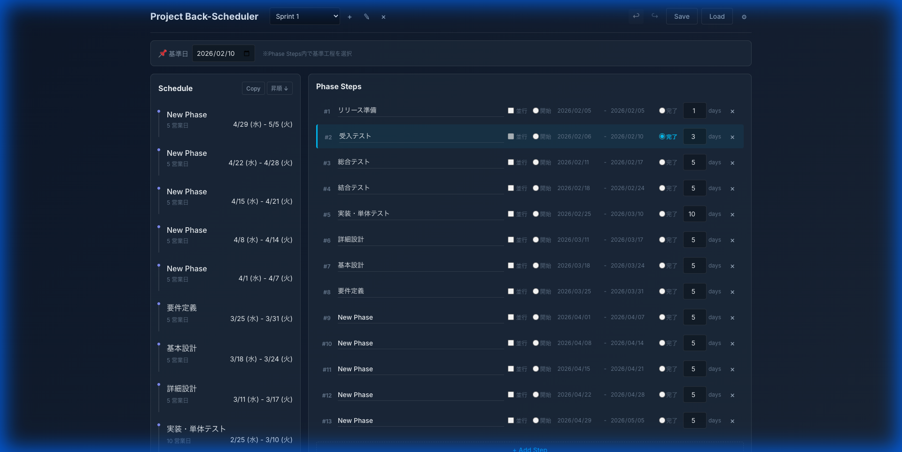

# Project Back-Scheduler

プロジェクトのスケジュールを**完了日から逆算**して自動計算するWebアプリケーション。



## 特徴

- 📅 **逆算スケジューリング**: 完了日（アンカー日）を基準に各工程の開始・終了日を自動計算
- 🎯 **営業日計算**: 土日祝日を除いた営業日ベースでスケジュール算出
- 🔄 **Undo/Redo**: 変更履歴を保持し、操作を取り消し・やり直し可能
- ⌨️ **キーボードショートカット**: 効率的な操作をサポート
- 📊 **ガントチャート**: 視覚的なスケジュール表示
- 💾 **ローカル保存**: LocalStorageによるデータ永続化

## 使い方

### 1. ローカルサーバーで起動

```bash
cd src
python3 -m http.server 8080
# ブラウザで http://localhost:8080 を開く
```

### 2. アンカー設定

Phase Steps内の各工程で「開始」または「完了」ラジオボタンを選択し、基準日（アンカー日）を設定します。

### 3. 工程管理

| 操作 | 方法 |
|:---|:---|
| 工程追加 | `+ Add Step` ボタン または `Cmd/Ctrl+N` |
| 工程削除 | 各行の `×` ボタン |
| Undo | `↩` ボタン または `Cmd/Ctrl+Z` |
| Redo | `↪` ボタン または `Cmd/Ctrl+Shift+Z` |
| 保存 | `Save` ボタン または `Cmd/Ctrl+S` |

## 技術スタック

- **HTML5 / CSS3 / Vanilla JavaScript** (ES Modules)
- フレームワーク不使用でシンプルな構成

## ディレクトリ構成

```
project-schedule-refactor/
├── src/
│   ├── index.html      # メインHTML
│   ├── style.css       # スタイルシート
│   ├── main.js         # エントリーポイント
│   ├── config.js       # 設定定数
│   ├── dateUtils.js    # 日付計算ユーティリティ
│   ├── state.js        # 状態管理
│   ├── scheduler.js    # スケジュール計算ロジック
│   ├── ui.js           # UI描画
│   ├── gantt.js        # ガントチャート描画
│   └── history.js      # Undo/Redo履歴管理
├── docs/               # ドキュメント
├── legacy/             # 旧バージョン（参照用）
└── tests/              # テスト
```

## ドキュメント読み込み順（プレフィックス）

`.md` ファイル名の先頭番号は、推奨される読み込み順を表します。

- `00`〜`09`: 日常運用で優先して読む主要ドキュメント
- `90`〜`99`: 評価レポートや過去方針などの参照資料

基本の読み順は、`00_GEMINI.md` → `01_HANDOVER.md` → `02_README.md` です。

## 用途別の推奨導線

### 新規参加者向け（全体把握）
1. `00_GEMINI.md`（ルール確認）
2. `01_HANDOVER.md`（現状と注意点）
3. `02_README.md`（使い方と構成）
4. `10_task.md` / `11_TODO.md`（進捗と未対応）

### 実装担当向け（機能追加・改修）
1. `00_GEMINI.md`
2. `01_HANDOVER.md`
3. `docs/docs/20_requirements.md`（要件）
4. `docs/docs/21_design.md`（設計）
5. `15_implementation_plan.md`（実装計画）
6. `docs/docs/30_test_plan.md`（テスト観点）
7. `10_task.md`（反映先）

### レビュー担当向け（変更妥当性確認）
1. `00_GEMINI.md`
2. `15_implementation_plan.md`
3. `docs/docs/20_requirements.md`
4. `docs/docs/21_design.md`
5. `docs/docs/30_test_plan.md`
6. `docs/docs/31_changelog.md`

## 開発履歴

### v1.1.0
- Undo/Redo機能
- キーボードショートカット

### v1.0.0
- コードのモジュール分割（7ファイル）
- UI/UXリデザイン（ビジネス向けフラットデザイン）
- Anchor設定のPhase Steps統合

## ライセンス

MIT License

---

## ドキュメント番号の意味

- ファイル名先頭の番号は推奨読込順を表します。
- 数字が小さいほど先に読む運用です。
- `90`番台は評価・方針などの参照資料です。
