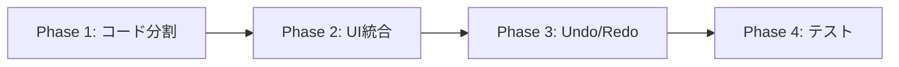

# リファクタリング方針書 (Refactoring Strategy)

<!-- Approved -->
> **Approved by**: wakaumekenji
> **Date**: 2026-02-08 01:21
> **Phase**: Strategy

**作成日**: 2026-02-08
**対象**: `project-schedule-refactor`

---

## 1. 評価結果サマリー

### コード品質評価 (Phase 0-A)
| カテゴリ | スコア | 主な問題 |
|:---|:---:|:---|
| アーキテクチャ | 2/5 | モノリシック (1,382行/1ファイル) |
| 可読性 | 3/5 | 巨大関数、インラインHTML |
| セキュリティ | 3/5 | XSSリスク |
| テスト容易性 | 1/5 | テストなし、DOM依存 |

### UI/UX評価 (Phase 0-B)
| カテゴリ | スコア | 主な問題 |
|:---|:---:|:---|
| デザイン | 4/5 | モダンだがカジュアルすぎる |
| レイアウト | 3/5 | 情報重複、マージン過大 |
| ユーザビリティ | 3/5 | Undo/Redoなし、日英混在 |
| アクセシビリティ | 2/5 | ARIA属性なし |

---

## 2. リファクタリング方針

### Phase 1: コード基盤整備 (Foundation)

**目的**: 保守性・拡張性の確保

| # | タスク | 優先度 | 概要 |
|:--|:---|:---:|:---|
| 1-1 | **ファイル分割** | 🔴必須 | `script.js` → 6ファイルに分割 |
| 1-2 | **XSSエスケープ** | 🔴必須 | ユーザー入力のサニタイズ |
| 1-3 | **イベント委譲** | 🟠推奨 | リスナー管理の効率化 |
| 1-4 | **定数集約** | 🟡任意 | マジックナンバー排除 |

**ファイル分割案**:
```
src/
├── config.js        # 定数、デフォルト設定
├── state.js         # 状態管理 + LocalStorage
├── dateUtils.js     # 日付計算ヘルパー
├── scheduler.js     # スケジュール計算ロジック
├── ui.js            # DOM操作 + レンダリング
├── gantt.js         # ガントチャート描画
└── main.js          # 初期化 + イベント登録
```

---

### Phase 2: UI/UXリデザイン (Redesign)

**目的**: ビジネスツールとしての使いやすさ向上

| # | タスク | 優先度 | 概要 |
|:--|:---|:---:|:---|
| 2-1 | **Anchor Settings統合** | 🔴必須 | Timeline Configuration削除、Phase Stepsに統合 |
| 2-2 | **マージン縮小** | 🔴必須 | `2rem` → `1rem`、情報密度向上 |
| 2-3 | **デザイントーン変更** | 🟠推奨 | グラスモーフィズム → フラットデザイン |
| 2-4 | **言語統一** | 🟠推奨 | 日本語に統一 |
| 2-5 | **絵文字→アイコン** | 🟡任意 | Lucide Icons等の導入 |

---

### Phase 3: 機能強化 (Enhancement)

**目的**: ユーザー体験の向上

| # | タスク | 優先度 | 概要 |
|:--|:---|:---:|:---|
| 3-1 | **Undo/Redo実装** | 🔴必須 | 状態履歴管理 |
| 3-2 | **キーボードショートカット** | 🟠推奨 | Ctrl+Z, Ctrl+S 等 |
| 3-3 | **祝日入力UI改善** | 🟠推奨 | カレンダーピッカー導入 |
| 3-4 | **ヘルプ/ツールチップ** | 🟡任意 | 初見ユーザー向け |

---

### Phase 4: 品質担保 (Quality)

**目的**: 継続的な品質維持

| # | タスク | 優先度 | 概要 |
|:--|:---|:---:|:---|
| 4-1 | **Jestテスト導入** | 🟠推奨 | dateUtils, scheduler から |
| 4-2 | **アクセシビリティ改善** | 🟡任意 | ARIA属性、フォーカス管理 |

---

## 3. 実行順序



1. **Phase 1** でコードを分割し、変更しやすい土台を作る
2. **Phase 2** でUI改善を行う（コード分割後の方が変更が容易）
3. **Phase 3** で機能追加（状態管理が整理されてから）
4. **Phase 4** でテスト導入（ロジックが分離されてから）

---

## 4. 承認事項

以下の方針で進めてよいかご確認ください：

1. **Phase 1 から順番に進める**（並行しない）
2. **各Phaseの完了時に承認を得る**
3. **必須タスクを優先し、任意は後回し**

---

> **次のアクション**: この方針書の承認後、Phase 1 の `15_implementation_plan.md` を作成します。

---

## ドキュメント番号の意味

- ファイル名先頭の番号は推奨読込順を表します。
- 数字が小さいほど先に読む運用です。
- `90`番台は評価・方針などの参照資料です。
